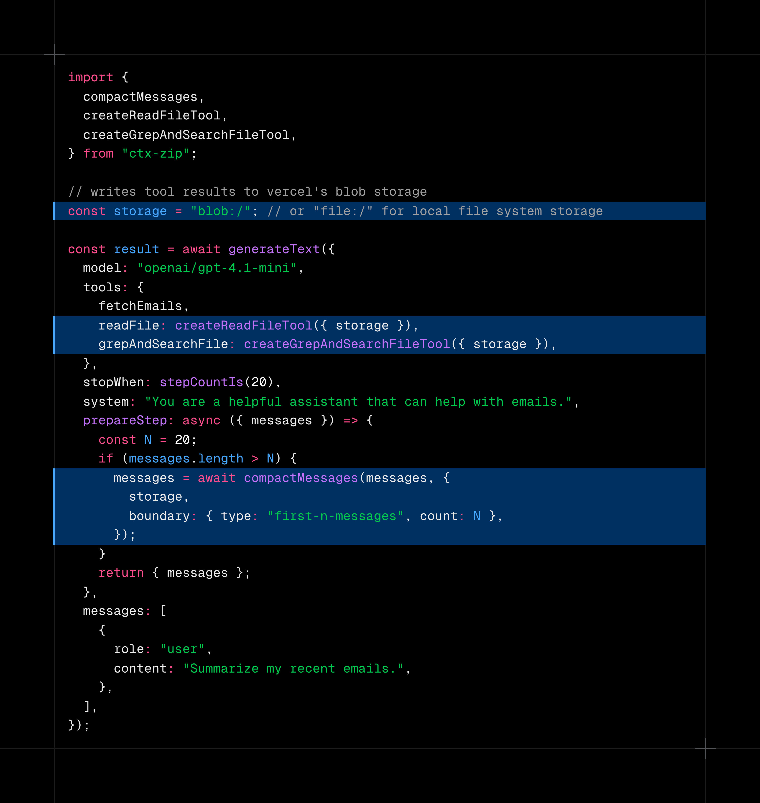
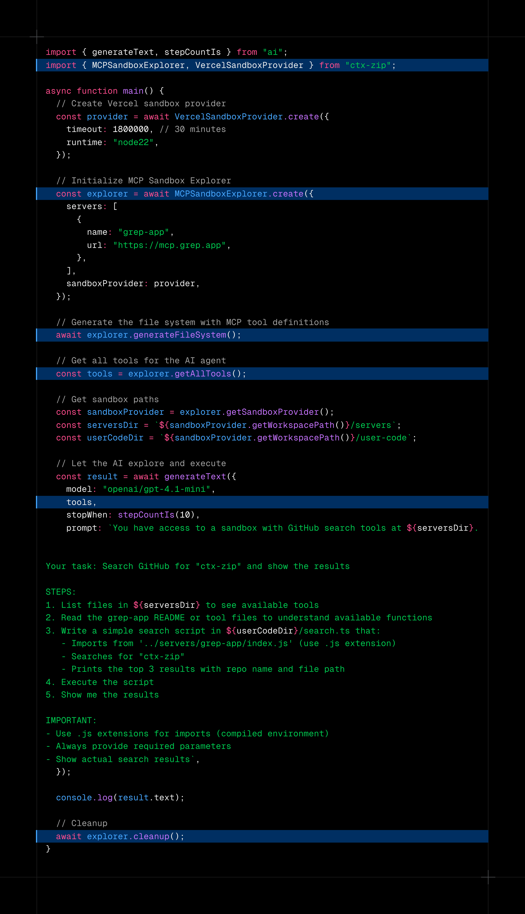

## ctx-zip

Keep your agent context small and cheap by zipping large tool results out of the conversation and into storage. ctx-zip automatically persists bulky tool outputs (JSON/text) to a storage backend and replaces them in the message list with short, human- and model-friendly references. You control when and how compaction happens, including a simple "last-N messages" strategy for long-running loops.

Works primarily with the AI SDK for agents and loop control. See: [AI SDK – Loop Control: Context Management](https://ai-sdk.dev/docs/agents/loop-control#context-management).

### What problem it solves

- **Context bloat**: Tool calls often return large payloads (logs, search results, files). Keeping these in the message history quickly exhausts the model context window and raises costs.
- **Slower iterations**: Bigger histories mean slower prompts and higher latency.

### How it solves it

- **Persist large tool outputs** to a storage backend (local filesystem or Vercel Blob) and **replace them with concise references** (e.g., `Written to storage: blob://prefix/abc.txt`).
 - **Out-of-the-box reader tools** let the model follow references and read/search on demand (e.g., `readFile`, `grepAndSearchFile`).
- **Configurable boundaries** let you decide what to compact (entire history, since the last assistant/user text, or preserve the first N messages such as system/instructions).
- **Works with AI SDK agent loops** via `prepareStep` so you can also layer a simple, robust "last-N" message-retention strategy.

---

## Installation

```bash
npm i ctx-zip
# or
pnpm add ctx-zip
```



---

## Quickstart: generateText with prepareStep (last-N + compaction)

The example below shows how to keep only the last N messages while also compacting tool results to storage on each step. It follows the AI SDK `prepareStep` pattern for loop control.

## Out-of-the-box tools for reading storage references

After compaction, the model will see short references like `Written to storage: blob://prefix/<key>`. The agent can then retrieve or search that content using the built-in tools below. Add them to your `tools` map so the model can call them when it needs to re-open persisted outputs.

- **readFile**: Reads a full file by `key` from a `storage` URI (`file://...` or `blob:`).
- **grepAndSearchFile**: Runs a regex search over a file in storage.

Usage:

```ts
import { generateText, stepCountIs } from "ai";
import { openai } from "@ai-sdk/openai";
import {
  compactMessages,
  createReadFileTool,
  createGrepAndSearchFileTool,
} from "ctx-zip";

// Choose a storage backend (see Storage section below)
// - Local filesystem (default if omitted): file:///absolute/path
// - Vercel Blob: blob: (requires BLOB_READ_WRITE_TOKEN)
const storageUri = `file://${process.cwd()}`;

const result = await generateText({
  model: "openai/gpt-4.1-mini",
  tools: {
    // Built-in tools so the model can read/search persisted outputs
    readFile: createReadFileTool(),
    grepAndSearchFile: createGrepAndSearchFileTool(),

    // ... your other tools (zod-typed) ...
  },
  stopWhen: stepCountIs(6),
  prompt: "Use tools to research, summarize, and cite sources.",
  prepareStep: async ({ messages }) => {
    // 1. Writes the tool results of the first 20 messages to a local file
    // 2. Replaces those messages with a reference to that file
    const compacted = await compactMessages(messages, {
      storage: storageUri,
      boundary: { type: "first-n-messages", count: 20 },
    });

    return { messages: compacted };
  },
});

console.log(result.text);
```

Notes:
- The compactor recognizes reader/search tools like `readFile` and `grepAndSearchFile` so their outputs aren’t re-written; a friendly "Read from storage" reference is shown instead.
- You can pass your own `storageReaderToolNames` to extend this behavior for custom reader tools. If you provide additional reader tools, include them in the `tools` map and add their names to `storageReaderToolNames` so compaction treats their outputs as references rather than rewriting to storage.

Tool inputs (model-provided):

- **readFile**: `{ key: string; storage: string }`
- **grepAndSearchFile**: `{ key: string; storage: string; pattern: string; flags?: string }`

By default, `compactMessages` treats `readFile` and `grepAndSearchFile` as reader tools and will not re-write their results back to storage; instead it replaces them with a short reference to the source so the context stays lean.

---

## Configuration Options

`compactMessages(messages, options)` accepts:

```ts
interface CompactOptions {
  strategy?: "write-tool-results-to-storage" | string; // default
  storage?: string | StorageAdapter | undefined;        // e.g. "file:///..." | "blob:" | adapter instance
  boundary?:
    | "since-last-assistant-or-user-text"
    | "entire-conversation"
    | { type: "first-n-messages"; count: number };     // keep first N intact
  serializeResult?: (value: unknown) => string;         // default: JSON.stringify(v, null, 2)
  storageReaderToolNames?: string[];                    // tool names that read from storage
}
```

- **strategy**: Currently only `write-tool-results-to-storage` is supported.
- **storage**: Destination for persisted tool outputs. Provide a URI (`file://...`, `blob:`) or an adapter.
- **boundary**:
  - `since-last-assistant-or-user-text` (default): Compact only the latest turn.
  - `entire-conversation`: Re-compact the full history.
  - `{ type: "first-n-messages", count: N }`: Preserve the first N messages (useful for system instructions) and compact the rest.
- **serializeResult**: Customize how non-string tool outputs are converted to text before writing.
- **storageReaderToolNames**: Tool names whose outputs will be replaced with a reference back to the source instead of being re-written.

---

## Storage Backends

ctx-zip supports local filesystem and Vercel Blob out of the box. Choose one via a URI in `CompactOptions.storage` or by passing a constructed adapter.

### Local filesystem (default)

- URI form: `file:///absolute/output/dir`
- If omitted, ctx-zip writes under `process.cwd()`.

Examples:

```ts
// Use a URI
await compactMessages(messages, { storage: "file:///var/tmp/ctx-zip" });

// Or construct an adapter
import { FileStorageAdapter } from "ctx-zip";
await compactMessages(messages, {
  storage: new FileStorageAdapter({ baseDir: "/var/tmp/ctx-zip" }),
});
```

### Vercel Blob

- URI form: `blob:` (optionally `blob://prefix`)
- Env: set `BLOB_READ_WRITE_TOKEN` (this single token is sufficient)

Examples:

```ts
// Use a URI (requires BLOB_READ_WRITE_TOKEN)
await compactMessages(messages, { storage: "blob:" });

// Or construct an adapter with a prefix
import { VercelBlobStorageAdapter } from "ctx-zip";
await compactMessages(messages, {
  storage: new VercelBlobStorageAdapter({ prefix: "my-agent" }),
});
```

`.env` example:

```bash
# Required for Vercel Blob
BLOB_READ_WRITE_TOKEN=vcblt_rw_...
```

---

## Implement a custom storage adapter (S3, Supabase, etc.)

Adapters implement a minimal interface so you can persist anywhere (S3, Supabase, GCS, Azure Blob, databases, …):

```ts
export interface StorageAdapter {
  write(params: { key: string; body: string | Uint8Array; contentType?: string }): Promise<{ key: string; url?: string }>;
  readText?(params: { key: string }): Promise<string>;
  openReadStream?(params: { key: string }): Promise<NodeJS.ReadableStream>;
  resolveKey(name: string): string; // map a file name to a storage key/path
  toString(): string;                // human-readable URI (e.g., "blob://prefix")
}
```

Example: S3 (sketch):

```ts
import { S3Client, PutObjectCommand, HeadObjectCommand, GetObjectCommand } from "@aws-sdk/client-s3";
import type { StorageAdapter } from "ctx-zip";

class S3StorageAdapter implements StorageAdapter {
  constructor(private bucket: string, private prefix = "") {}

  resolveKey(name: string) {
    const safe = name.replace(/\\/g, "/").replace(/\.+\//g, "");
    return this.prefix ? `${this.prefix.replace(/\/$/, "")}/${safe}` : safe;
  }

  async write({ key, body, contentType }: { key: string; body: string | Uint8Array; contentType?: string }) {
    const s3 = new S3Client({});
    const Body = typeof body === "string" ? new TextEncoder().encode(body) : body;
    await s3.send(new PutObjectCommand({ Bucket: this.bucket, Key: key, Body, ContentType: contentType }));
    return { key, url: `s3://${this.bucket}/${key}` };
  }

  toString() {
    return `s3://${this.bucket}${this.prefix ? "/" + this.prefix : ""}`;
  }
}

// Usage
// await compactMessages(messages, { storage: new S3StorageAdapter("my-bucket", "agent-prefix") });
```

You can apply the same pattern to Supabase Storage, GCS, Azure Blob, or any other service.

---

## Tips

- Pair compaction with AI SDK loop control to dynamically trim history and adjust models/tools per step. See: [AI SDK – Loop Control: Context Management](https://ai-sdk.dev/docs/agents/loop-control#context-management).
- When preserving long-lived system instructions, consider `boundary: { type: "first-n-messages", count: N }`.
- For debugging, use the file backend first (`file://...`) to inspect outputs locally, then switch to `blob:` for production.

---

## API Surface

From `ctx-zip`:

- **Compaction**: `compactMessages(messages, options)` and `CompactOptions`
- **Strategies**: `detectWindowStart`, `messageHasTextContent` (advanced)
- **Storage Adapters**: `FileStorageAdapter`, `VercelBlobStorageAdapter`, `createStorageAdapter(uriOrAdapter)`
- **Utilities**: `resolveFileUriFromBaseDir`, `grepObject` (advanced)
- **Tools**: `createReadFileTool`, `createGrepAndSearchFileTool` (recognized as reader tools by default)


---

## MCP Sandbox Explorer

ctx-zip now includes `MCPSandboxExplorer` - a tool that enables efficient code execution with MCP (Model Context Protocol) servers, reducing context bloat and improving agent performance.

### The Problem: Context Bloat from MCP Tools

Traditional MCP integration loads all tool definitions upfront into the model's context window. With hundreds or thousands of tools across multiple MCP servers, this approach:
- **Overloads context**: Tool definitions can consume hundreds of thousands of tokens before the model even sees your prompt
- **Lowers Accuracy**: Running and loading tool results in a loop can quickly bloat the context which can ultimately lead to lower accuracy
- **Increases costs**: Every tool definition and intermediate result passes through the model
- **Slows responses**: Large context windows increase latency

### The Solution: Progressive Discovery + Code Execution

Instead of loading all tools upfront, `MCPSandboxExplorer`:
1. **Transforms MCP tools into TypeScript modules** with JSDoc documentation
2. **Loads them into a sandbox file system** (Vercel, E2B, or Local)
3. **Gives agents filesystem exploration tools** (ls, cat, grep, find) to progressively discover only what they need
4. **Lets agents write and execute code** that calls MCP tools, processing data in the sandbox before returning results

**Result**: >80%+ reduction in token usage for complex multi-tool workflows. Intermediate results stay in the sandbox, only final outputs flow through the model's context.



### Benefits

- **📉 Massive Token Savings**: Load only the tools you need, not all thousands upfront
- **⚡ Faster Responses**: Smaller context windows = lower latency
- **💰 Lower Costs**: Process data in sandbox, not through expensive LLM calls
- **🔒 Better Privacy**: Sensitive data stays in sandbox, never touches model context
- **🎯 Progressive Discovery**: Agents explore and load tools on-demand
- **🧩 Tool Composition**: Chain multiple MCP calls in a single code execution
- **📊 Data Processing**: Filter, transform, aggregate data before returning to model

Read more about this technique: [Code execution with MCP: Building more efficient agents](https://www.anthropic.com/engineering/code-execution-with-mcp)

### Installation

The MCP Sandbox Explorer and all sandbox providers are included with ctx-zip:

```bash
npm install ctx-zip
```

All sandbox providers (`@modelcontextprotocol/sdk`, `@e2b/code-interpreter`, `@vercel/sandbox`) are installed automatically as optional dependencies. No additional installation needed!

### Sandbox Providers

`MCPSandboxExplorer` uses a **pluggable sandbox provider architecture**, allowing you to choose the execution environment that best fits your needs:

#### Built-in Providers

| Provider | Best For | Setup | Cost |
|----------|----------|-------|------|
| **Vercel** | Vercel apps, quick prototyping | API key | Paid tier available |
| **E2B** | Production, TypeScript execution, custom packages | API key | Paid tier available |
| **Local** | Debugging, development, learning | None | Free |

**Vercel Sandbox** (Default):
```typescript
import { MCPSandboxExplorer, VercelSandboxProvider } from "ctx-zip";

const provider = await VercelSandboxProvider.create({
  timeout: 1800000,
  runtime: "node22",
});

const explorer = await MCPSandboxExplorer.create({
  servers: [
    { name: "grep-app", url: "https://mcp.grep.app" },
    { name: "linear", url: "https://mcp.linear.app/mcp" }
  ],
  sandboxProvider: provider,
});
```

**E2B Sandbox**:
```typescript
import { MCPSandboxExplorer, E2BSandboxProvider } from "ctx-zip";

const provider = await E2BSandboxProvider.create({
  apiKey: process.env.E2B_API_KEY,
});

const explorer = await MCPSandboxExplorer.create({
  servers: [
    { name: "grep-app", url: "https://mcp.grep.app" },
    { name: "linear", url: "https://mcp.linear.app/mcp" }
  ],
  sandboxProvider: provider,
});
```

**Local Sandbox** (For Development):
```typescript
import { MCPSandboxExplorer, LocalSandboxProvider } from "ctx-zip";

const provider = await LocalSandboxProvider.create({
  sandboxDir: "./.sandbox", // Inspect generated files directly!
});

const explorer = await MCPSandboxExplorer.create({
  servers: [
    { name: "grep-app", url: "https://mcp.grep.app" },
    { name: "linear", url: "https://mcp.linear.app/mcp" }
  ],
  sandboxProvider: provider,
});

// Files written to ./.sandbox/ - great for debugging!
```

#### Custom Sandbox Providers

You can implement your own sandbox provider (Docker, AWS Lambda, etc.) by implementing the `SandboxProvider` interface:

```typescript
interface SandboxProvider {
  writeFiles(files: SandboxFile[]): Promise<void>;
  runCommand(command: SandboxCommand): Promise<CommandResult>;
  stop(): Promise<void>;
  getId(): string;
  getWorkspacePath(): string;
}
```

See [`SANDBOX_PROVIDERS.md`](./SANDBOX_PROVIDERS.md) for detailed documentation on:
- Implementing custom providers
- Provider comparison and features
- Advanced provider usage examples

### Quick Start

```typescript
import { generateText, stepCountIs } from "ai";
import { MCPSandboxExplorer, VercelSandboxProvider } from "ctx-zip";

// Create Vercel sandbox provider
const provider = await VercelSandboxProvider.create();

// Initialize with MCP servers
const explorer = await MCPSandboxExplorer.create({
  servers: [
    { name: "grep-app", url: "https://mcp.grep.app" },
    { 
      name: "linear", 
      url: "https://mcp.linear.app/mcp",
      headers: {
        Authorization: `Bearer ${process.env.LINEAR_OAUTH_TOKEN}`,
      },
    },
  ],
  sandboxProvider: provider,
});

// Generate file system with tool definitions
await explorer.generateFileSystem();

// Get AI SDK tools for exploration and execution
const tools = explorer.getAllTools();

// Let the agent explore and use MCP tools
const result = await generateText({
  model: "openai/gpt-4.1-mini",
  tools,
  stopWhen: stepCountIs(15),
  prompt: "Search the codebase using grep-app and create a Linear issue",
});

console.log(result.text);

// Cleanup
await explorer.cleanup();
```

### Authentication

MCP servers often require authentication via headers (API keys, Bearer tokens, etc.). Store tokens in environment variables and pass them via the `headers` property:

```bash
# .env
LINEAR_OAUTH_TOKEN=lin_api_your_token_here
```

```typescript
import dotenv from "dotenv";
dotenv.config();

const explorer = await MCPSandboxExplorer.create({
  servers: [
    {
      name: "grep-app",
      url: "https://mcp.grep.app",
      // No auth required
    },
    {
      name: "linear",
      url: "https://mcp.linear.app/mcp",
      headers: {
        Authorization: `Bearer ${process.env.LINEAR_OAUTH_TOKEN}`,
      },
    },
  ],
  sandboxProvider: provider,
});
```

**Note:** For OAuth-based MCP servers, obtain tokens through the provider's OAuth flow (outside the sandbox) beforehand. Interactive OAuth flows are not supported inside sandbox environments.

### Generated File Structure

The explorer generates a file tree in the sandbox workspace. The base path depends on your provider:
- **Vercel**: `/vercel/sandbox/servers/`
- **E2B**: `/home/user/servers/`
- **Local**: `./.sandbox/servers/`

```
servers/
├── grep-app/
│   ├── search.ts           # Type definitions + function
│   ├── getFileContent.ts
│   └── index.ts            # Re-exports all tools
├── linear/
│   ├── createIssue.ts
│   ├── listIssues.ts
│   └── index.ts
└── _client.ts              # MCP routing client
```

Each tool file contains:
- TypeScript interfaces for input/output
- JSDoc documentation
- Executable function that calls the MCP tool

Example generated file:

```typescript
import { callMCPTool } from '../_client.js';

/**
 * Create a new issue in Linear
 * 
 * @param input.title - The issue title
 * @param input.description - The issue description
 * @param input.teamId - The team ID to create the issue in
 * @example
 * ```typescript
 * const issue = await createIssue({ 
 *   title: 'Bug in authentication',
 *   description: 'Users unable to login',
 *   teamId: 'team_123'
 * });
 * console.log(issue.id);
 * ```
 */
export interface CreateIssueInput {
  title: string;
  description?: string;
  teamId: string;
}

export interface CreateIssueOutput {
  id: string;
  title: string;
  url: string;
}

export async function createIssue(
  input: CreateIssueInput
): Promise<CreateIssueOutput> {
  return callMCPTool<CreateIssueOutput>('linear', 'createIssue', input);
}
```

### Available AI SDK Tools

The explorer provides these tools for agents:

- **sandbox_ls**: List directory contents (files and folders)
- **sandbox_cat**: Read file contents (view tool definitions)
- **sandbox_grep**: Search for patterns in files
- **sandbox_find**: Find files by name pattern
- **sandbox_exec**: Execute TypeScript code in the sandbox

### API Reference

#### MCPSandboxExplorer.create(config)

Initialize a new sandbox explorer.

```typescript
interface SandboxExplorerConfig {
  servers: MCPServerConfig[];
  
  // Option 1: Use custom sandbox provider
  sandboxProvider?: SandboxProvider;
  
  // Option 2: Use default Vercel provider with options
  sandboxOptions?: {
    timeout?: number;           // default: 1800000 (30 min)
    runtime?: 'node22' | 'python3.13';  // default: 'node22'
    vcpus?: number;            // default: 4
  };
  
  outputDir?: string;          // default: 'servers' (relative to workspace)
}

interface MCPServerConfig {
  name: string;
  url: string;
  headers?: Record<string, string>;
  useSSE?: boolean;
}
```

#### Methods

- `generateFileSystem()`: Fetch tools and generate file system
- `getExplorationTools()`: Get ls, cat, grep, find tools
- `getExecutionTool()`: Get code execution tool
- `getAllTools()`: Get all tools (exploration + execution)
- `getToolsSummary()`: Get info about discovered tools
- `getSandboxProvider()`: Get the sandbox provider instance
- `cleanup()`: Stop the sandbox and clean up

### Use Cases

1. **Progressive API Discovery**: Let agents explore available APIs before writing code
2. **Context Efficiency**: 98%+ reduction in token usage by processing data in sandbox
3. **Self-Documenting Tools**: Generated files include full type definitions and JSDoc
4. **Safe Code Execution**: Code runs in isolated sandbox environments
5. **Multi-MCP Integration**: Connect to multiple MCP servers simultaneously
6. **Agent Workflows**: Agents can read documentation, write code, and execute it

### Examples

The library includes several examples demonstrating different use cases:

```bash
# Vercel Sandbox (Default)
npm run example:mcp-vercel

# E2B Sandbox
npm run example:mcp-e2b

# Local Sandbox (Great for debugging)
npm run example:mcp-local
```

See the [`examples/`](./examples/) directory for complete working examples with detailed comments.

---

Built with ❤️ by the team behind [Langtrace](https://langtrace.ai) and [Zest](https://heyzest.ai).

